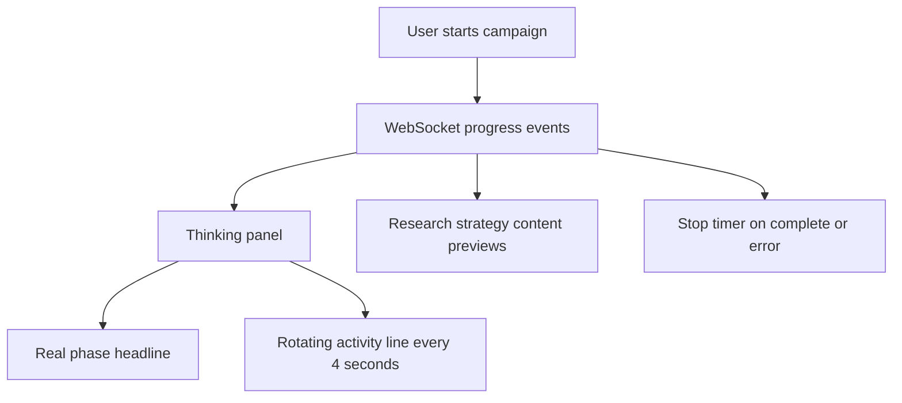

# Chat UI/UX Polish Plan

## Scope

- Polish the main chat experience in [web/templates/dashboard.html](web/templates/dashboard.html), [web/static/chat.js](web/static/chat.js), and [web/static/app.css](web/static/app.css).
- Keep the existing backend/WebSocket pipeline intact; it already sends real phase events that the frontend can enrich.
- Touch [web/templates/campaign_detail.html](web/templates/campaign_detail.html) only for light visual consistency if the shared card/button styles need it.

## Implementation Approach

- Refresh the visual system in [web/static/app.css](web/static/app.css): cleaner spacing, more premium cards, stronger hierarchy, smoother hover/focus states, better mobile behavior, and a more modern chat/composer treatment.
- Upgrade the live thinking panel in [web/static/chat.js](web/static/chat.js) from a single secondary status line into a small activity stream that rotates every ~4 seconds while the run is active.
- Generate context-aware waiting messages based on pipeline phase, for example: “Looking on LinkedIn for public signals”, “Scanning Google results”, “Checking local reviews”, “Turning research into content angles”, “Drafting hooks”, and “Reviewing brand fit”.
- Preserve real WebSocket updates as the source of truth: real progress events update the headline, preview, and history; the rotating messages fill silence between backend events.
- Stop the rotating timer cleanly on `complete`, `error`, or connection failure so the UI never keeps pretending work is ongoing.
- Add subtle motion for the activity feed: new line fade/slide, pulsing status dot, and optional compact progress rail treatment.

## Activity Feed Shape

## Verification

- Run the app locally and start a campaign to confirm the activity messages rotate while waiting and stop at completion.
- Check mobile layout around the chat rail, message stream, composer, and campaign detail cards.
- Use linter diagnostics for edited frontend files and fix any introduced JavaScript/CSS issues.

