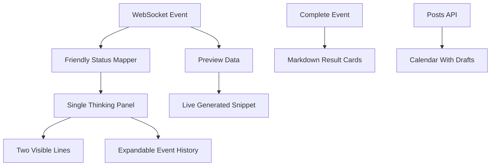

# Chat UX Polish Plan

## Goals

- Keep the chat app fixed within the viewport instead of making the page infinitely long.
- Replace many progress messages with one animated expandable “Thinking / Searching” panel that shows only two visible lines by default.
- Show user-friendly live generation snippets so the user can see activity without exposing raw technical logs.
- Make calendar reflect generated posts, including drafts, not only approved/scheduled/published posts.
- Make content cards uniform in size, scroll internally when needed, and render Markdown nicely.
- Improve the content generation prompt so final posts are more polished and display-ready.

## Frontend Layout

- Update `[web/static/app.css](web/static/app.css)`:
  - Set the main chat workspace to a viewport-bounded height, e.g. `height: calc(100vh - header/hero space)` with a minimum and maximum.
  - Keep `.messages` as the only scrollable area inside the chat panel.
  - Make result/content cards use fixed or consistent heights with internal scrolling for long body text.
  - Add Markdown styling for headings, lists, paragraphs, strong text, links, hashtags, and code-style snippets.
- Update `[web/templates/dashboard.html](web/templates/dashboard.html)`:
  - Keep the hero compact so the chat remains visible above the fold.
  - Optionally make the chat workspace the dominant element and reduce recent campaign visual weight.

## Thinking Panel Behavior

- Update `[web/static/chat.js](web/static/chat.js)`:
  - Replace per-event progress assistant messages with a single persistent run status card.
  - The card should show two visible lines:
    - current phase summary, e.g. “Searching public sources...”
    - latest friendly activity, e.g. “Found Google Maps and social profile signals.”
  - Add an expandable details area below those two lines with compact event history.
  - Animate the panel using a pulsing dot/skeleton line while running.
  - On completion, collapse the thinking panel and add a final result card.
- Use existing WebSocket fields from `[web/app.py](web/app.py)`: `event_type`, `phase`, `progress`, `message`, `details`, and `data`.
- Make messages user-friendly by mapping technical phases to plain language in `chat.js`.

## Live Generation Output

- Update `[web/app.py](web/app.py)`:
  - Include non-technical `preview` fields in WebSocket messages when possible:
    - research complete: business name, confidence, source counts.
    - strategy complete: pillar/channel counts.
    - content progress: post headline/topic/channel and short body preview.
  - Keep technical details in `details`, but render friendly previews by default.
- Update `[web/static/chat.js](web/static/chat.js)`:
  - Render preview chips or mini snippets inside the persistent thinking panel.
  - Show the latest generated post title/body excerpt as soon as content progress arrives.

## Calendar Fix

- Update `[web/app.py](web/app.py)`:
  - Change `/calendar` to include generated draft posts as well as approved/scheduled/published posts.
  - If needed, sort posts by date/time and campaign.
- Update `[web/templates/calendar.html](web/templates/calendar.html)`:
  - Show post status and campaign name in each calendar chip.
  - Add a small empty-state note only when there truly are no generated posts.

## Uniform Content Cards + Markdown Rendering

- Add a lightweight Markdown rendering path:
  - Prefer client-side Markdown rendering in `[web/static/chat.js](web/static/chat.js)` and detail page script to avoid backend complexity.
  - Implement a small safe renderer for the content style we expect: headings, bold, bullet lists, line breaks, links, and paragraphs.
- Update `[web/templates/campaign_detail.html](web/templates/campaign_detail.html)`:
  - Replace plain `
{{ post.body }}
` with Markdown-ready containers, e.g. `data-markdown`.
  - Make each content card a uniform height with a scrollable `.content-card-body`.
  - Keep copy buttons and metadata visible.
- Update `[web/static/app.css](web/static/app.css)`:
  - Add `.content-grid`, `.content-card`, `.content-card-body`, and `.markdown-body` classes.

## Prompt Quality

- Update `[utils/prompts.py](utils/prompts.py)`:
  - Rewrite `CONTENT_SYSTEM_PROMPT` and `CONTENT_USER_PROMPT` to request display-ready Markdown.
  - Ask for a consistent structure:
    - hook
    - body
    - proof/evidence-backed angle when appropriate
    - CTA
    - hashtags
    - image idea
  - Keep language specific, human, and brand-aligned.
  - Avoid generic filler, hype words, unsupported claims, and overlong posts.
- Update parsing only if needed in `[phases/content.py](phases/content.py)`, preserving current extraction but making it tolerant of Markdown sections.

## Validation

- Run lints/diagnostics on changed files.
- Run route smoke checks for `/`, `/calendar`, `/campaign/{id}` if a campaign exists, and `/api/health`.
- Manually verify:
  - chat remains fixed with internal scroll.
  - only one thinking panel updates during the run.
  - calendar shows generated draft posts.
  - content cards are uniform and Markdown renders correctly.

