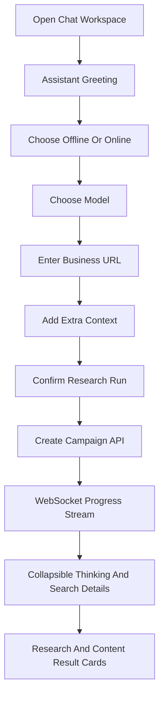

# Chatbot UI Replacement

## Direction

- Replace the current dashboard-first UI with a single polished chatbot workspace inspired by a minimalist YC product: calm, fast, conversational, mostly neutral colors, sharp typography, generous whitespace, subtle motion.
- Keep the backend FastAPI/Jinja stack for speed, but make the frontend feel like an interactive app using vanilla JavaScript, WebSocket events, and a small set of focused templates/static assets.
- Use the guidance in `[fornt-end.md](fornt-end.md)`: avoid generic AI dashboard visuals, choose a strong refined aesthetic, and build a production-grade interface with deliberate typography, spacing, motion, and microinteractions.

## UX Flow

- On `/`, show a chatbot-style landing/workspace instead of the current dashboard:
  - assistant greeting: “Hi, I’ll research a business and build a campaign.”
  - quick suggestions such as “Research my startup”, “Find competitors”, “Build LinkedIn content”, “Analyze local business”.
  - step-by-step questions:
    - model mode: offline/local or online/provider.
    - model choice, using configured local model and optional online choices.
    - business link.
    - extra context: goals, target audience, location, competitors, content style, anything to avoid.
    - confirmation summary before starting.
- While running, render pipeline events as chat messages:
  - “Searching with SerpApi…”
  - “Reading Google Maps/local signals…”
  - “Searching Tavily market context…”
  - “Extracting pages with Firecrawl…”
  - “Synthesizing research with local LLM…”
- Each progress message can include a collapsible “thinking/search details” dropdown, ChatGPT-style, for raw phase notes, source counts, tool names, and confidence.
- After completion, present results in-chat:
  - campaign summary card.
  - research evidence/source coverage.
  - social profiles and Google Maps signals.
  - generated posts with copy actions.
  - links to optional detail views if we keep them.

## Backend/API Changes

- Update `[web/app.py](web/app.py)`:
  - Make `/` render the new chatbot workspace.
  - Keep existing API routes for campaign creation and data fetching.
  - Add a lightweight chat/session endpoint if needed, e.g. `/api/chat/start`, or reuse `POST /api/campaigns` once the chat has collected all fields.
  - Include model mode, selected model, and extra context in the campaign creation request.
- Update `[web/database.py](web/database.py)`:
  - Add campaign metadata fields if needed: `model_mode`, `model_name`, `extra_context`, `user_goal`.
  - Add SQLite migration for existing local databases.
- Update pipeline invocation in `[web/app.py](web/app.py)`:
  - Pass selected model/context into the pipeline where possible.
  - Improve WebSocket messages so the frontend can distinguish `thinking`, `searching`, `tool_result`, `phase_complete`, `error`, and `complete`.
- Optionally update prompts in `[utils/prompts.py](utils/prompts.py)` so the user’s extra context influences research/strategy/content.

## Frontend File Plan

- Replace most of the current UI implementation:
  - `[web/templates/base.html](web/templates/base.html)`: simplify into a chat-app shell, not a sidebar dashboard.
  - `[web/templates/dashboard.html](web/templates/dashboard.html)`: become the main chatbot workspace.
  - `[web/templates/new_campaign.html](web/templates/new_campaign.html)`: either remove from active navigation or redirect/reuse the chatbot workspace.
  - `[web/templates/campaign_detail.html](web/templates/campaign_detail.html)`: keep as a secondary result detail page, but restyle to match the chat UI.
  - `[web/templates/calendar.html](web/templates/calendar.html)` and `[web/templates/settings.html](web/templates/settings.html)`: keep only if useful, restyled under the same visual system.
- Rebuild `[web/static/app.css](web/static/app.css)`:
  - Remove dashboard/sidebar-heavy CSS.
  - Add chat layout, message bubbles, composer, suggestion chips, collapsible thinking panels, result cards, source chips, loading animations, and responsive mobile layout.
- Add `[web/static/chat.js](web/static/chat.js)`:
  - Manage conversational state machine.
  - Render assistant/user messages.
  - Validate business URL.
  - Collect model mode/model/business URL/extra context.
  - Start campaign via API.
  - Connect to WebSocket and stream progress into collapsible dropdown messages.

## Interaction Model

## Design Details

- Aesthetic: “quiet YC research cockpit”, not neon dashboard.
- Visual language:
  - off-white or warm light background with black/graphite text, or a refined near-black workspace with paper-like chat cards.
  - one restrained accent color for actions and active state.
  - strong but not generic typography; avoid the current purple/cyan dashboard look.
  - smooth message entrance animations and collapsible detail transitions.
- Chat components:
  - assistant avatar/mark.
  - user bubbles.
  - suggestion chips.
  - input composer with multiline support.
  - model picker cards for offline/online.
  - progress timeline embedded as assistant messages.
  - “Thinking / Searching” disclosure component with compact event logs.

## Validation

- Run route smoke checks for `/`, `/campaign/{id}`, `/calendar`, `/settings`, and `/api/health`.
- Test chat flow manually in browser:
  - offline model selection.
  - business URL validation.
  - extra context entry.
  - WebSocket progress rendering.
  - completion redirect/result rendering.
- Use existing structural tests and add focused tests for new campaign metadata if database/model fields are added.

