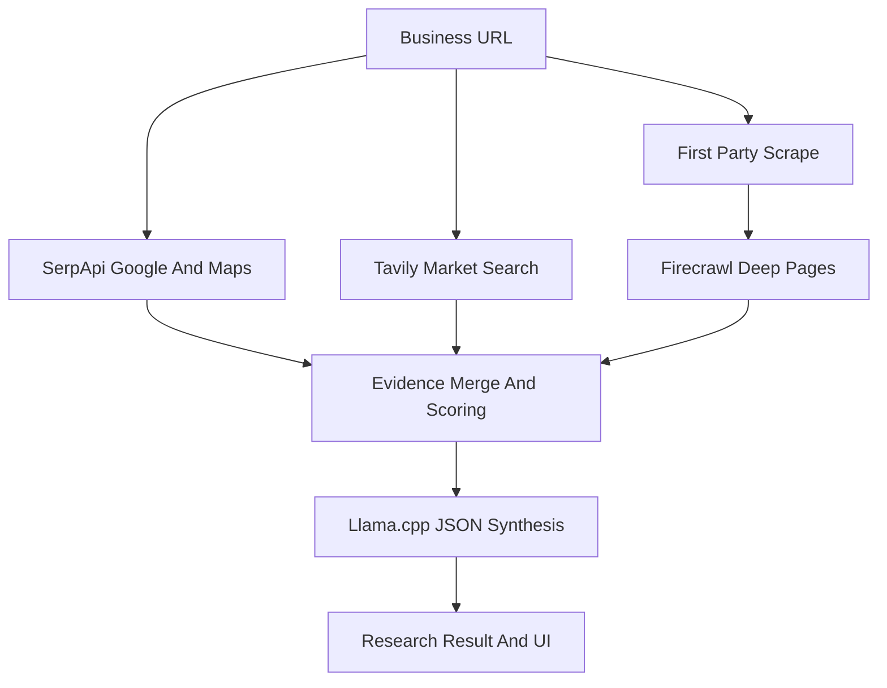

# Phase 1 Deep OSINT + Frontend Upgrade

## Current Shape
- Phase 1 lives in [`/home/dev/project/phases/research.py`](/home/dev/project/phases/research.py): it scrapes the site, runs a few Tavily queries, then synthesizes with the LLM.
- Existing clients are in [`/home/dev/project/clients/`](/home/dev/project/clients/): Tavily and scraper/Firecrawl exist; SerpApi does not.
- The LLM client is [`/home/dev/project/clients/openrouter.py`](/home/dev/project/clients/openrouter.py), but it is currently OpenRouter-specific even though llama.cpp exposes an OpenAI-compatible API.
- The frontend is Jinja/FastAPI in [`/home/dev/project/web/templates/`](/home/dev/project/web/templates/) with mixed styling, duplicated layout, and no shared base template.

## Backend Plan
- Add SerpApi configuration in [`/home/dev/project/config/settings.py`](/home/dev/project/config/settings.py), [`/home/dev/project/.env.example`](/home/dev/project/.env.example), and docs:
  - `SERPAPI_KEY`
  - optional local/search settings such as max results, locale, and maps depth.
- Add a new async SerpApi client in [`/home/dev/project/clients/serpapi.py`](/home/dev/project/clients/serpapi.py), using the SerpApi Python integration concepts but matching this repo’s async `httpx` style. It will support:
  - Google Search for brand, reviews, competitors, social profiles, and news-like discovery.
  - Google Maps / local discovery with `engine=google_maps` for address, rating, reviews count, category, hours, phone, website, geo coordinates, and nearby competitors.
  - Targeted social discovery queries for Instagram, LinkedIn, Facebook, X, YouTube, TikTok, directories, review sites, and public profiles.
- Keep Tavily as the “deep web answer” tool in [`/home/dev/project/clients/tavily.py`](/home/dev/project/clients/tavily.py), but expand Phase 1 query planning so Tavily covers market positioning, customer language, competitors, pains, FAQs, and industry context.
- Upgrade Firecrawl usage in [`/home/dev/project/clients/scraper.py`](/home/dev/project/clients/scraper.py): use it deliberately for key public pages and discovered social/directory pages when HTTP scraping is weak, instead of only fallback scraping.
- Refactor [`/home/dev/project/phases/research.py`](/home/dev/project/phases/research.py) into a deeper OSINT workflow:
  - normalize the business URL and infer business/domain/name/location candidates.
  - scrape first-party pages with HTTP/Firecrawl.
  - run SerpApi searches for Google, Google Maps, reviews, competitors, and public social footprints.
  - run Tavily searches for synthesized market intelligence and wider context.
  - optionally Firecrawl the strongest discovered URLs.
  - merge, dedupe, score, and preserve evidence before LLM synthesis.
- Expand [`/home/dev/project/models/research.py`](/home/dev/project/models/research.py) and [`/home/dev/project/web/database.py`](/home/dev/project/web/database.py) to store richer Phase 1 evidence, such as:
  - `locations`, `social_profiles`, `reviews_summary`, `osint_sources`, `search_tool_coverage`, `competitor_evidence`, and `research_depth`.
- Update [`/home/dev/project/utils/prompts.py`](/home/dev/project/utils/prompts.py) so synthesis asks for evidence-grounded output and clear uncertainty, not generic marketing guesses.

## Llama.cpp Plan
- Generalize [`/home/dev/project/clients/openrouter.py`](/home/dev/project/clients/openrouter.py) into an OpenAI-compatible chat client while preserving existing env compatibility where practical.
- Add settings like:
  - `LLM_BASE_URL=http://localhost:8080/v1`
  - `LLM_API_KEY=` optional for llama.cpp
  - `LLM_MODEL=qwen-3.6...`
  - `LLM_DISABLE_THINKING=true`
- Disable Qwen thinking for speed by sending the appropriate OpenAI-compatible request options when configured. If the backend does not support a native flag, add a system instruction and/or model parameter guard so outputs avoid chain-of-thought and return concise JSON/text only.

## Frontend Plan
- Add a shared Jinja base layout, likely [`/home/dev/project/web/templates/base.html`](/home/dev/project/web/templates/base.html), plus shared CSS/JS under [`/home/dev/project/web/static/`](/home/dev/project/web/static/).
- Refactor the main pages to extend the base layout:
  - [`dashboard.html`](/home/dev/project/web/templates/dashboard.html)
  - [`new_campaign.html`](/home/dev/project/web/templates/new_campaign.html)
  - [`campaign_detail.html`](/home/dev/project/web/templates/campaign_detail.html)
  - [`calendar.html`](/home/dev/project/web/templates/calendar.html)
  - [`settings.html`](/home/dev/project/web/templates/settings.html)
- Build a more polished workflow for the whole solution:
  - clearer dashboard metrics and campaign cards.
  - Phase 1 progress that names the active tool: SerpApi, Tavily, Firecrawl, LLM synthesis.
  - richer research detail page showing evidence, source coverage, social profiles, Google Maps/local data, and confidence.
  - consistent navigation, mobile-friendly layout, better empty/loading/error states.
- Keep the app server-rendered with FastAPI/Jinja for now, avoiding a larger SPA rewrite unless you ask for that separately.

## Validation
- Add or update focused tests around client response normalization, research merge/dedupe logic, and prompt/input shaping.
- Run the existing lightweight pipeline tests plus FastAPI route smoke checks.
- Avoid live API tests by default unless keys are present; use mocked SerpApi/Tavily/Firecrawl responses for repeatable tests.

