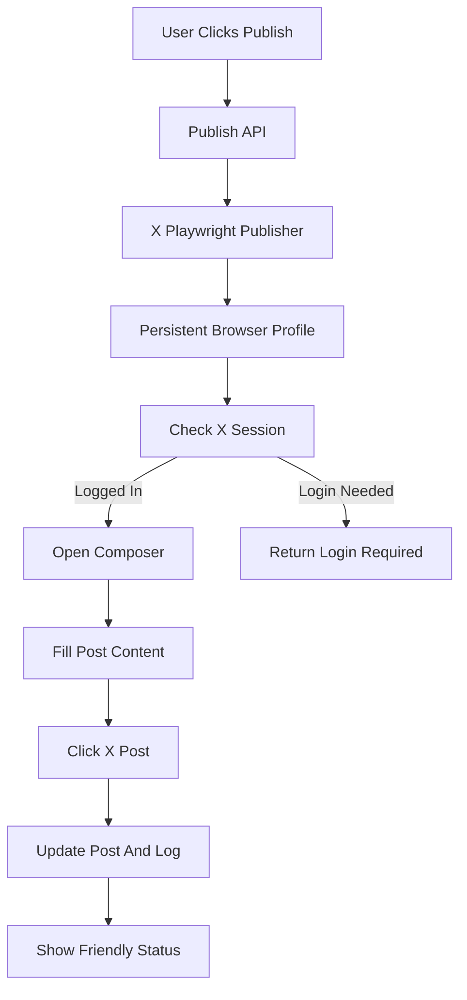

# X Playwright Publishing + Better Process UX

## Scope
- First platform: X/Twitter only.
- User action: one in-app Publish click.
- Authentication: Playwright persistent browser profile. The user logs into X once; later publishes reuse that browser session.
- Keep platform automation behind explicit post-level approval/publish actions. No hidden auto-posting during content generation.

## Backend Publishing Plan
- Add Playwright dependency to [`requirements.txt`](requirements.txt).
- Add settings in [`config/settings.py`](config/settings.py) and [`/.env.example`](.env.example):
  - `PLAYWRIGHT_USER_DATA_DIR=./outputs/playwright/x-profile`
  - `PLAYWRIGHT_HEADLESS=false` by default for login/debugging.
  - `X_COMPOSE_URL=https://x.com/compose/post`
- Add a new publisher client, likely [`clients/playwright_x.py`](clients/playwright_x.py):
  - launch Chromium with `launch_persistent_context`.
  - open X composer.
  - fill the generated post content.
  - click the platform Post button.
  - return success metadata or a clear error.
  - detect unauthenticated state and return “login required” with instructions.
- Add a publishing service layer, likely [`phases/publishing.py`](phases/publishing.py) or [`clients/publisher.py`](clients/publisher.py), to keep browser automation out of [`web/app.py`](web/app.py).

## Database/API Plan
- Extend [`web/database.py`](web/database.py):
  - add a `PublishingLog` table with `post_id`, `platform`, `status`, `message`, `published_at`, `error`, and optional `platform_post_url`.
  - keep existing `Post.publish_error`, `Post.platform_post_id`, and `Post.published_at` fields.
- Update [`web/app.py`](web/app.py):
  - replace the placeholder `/api/posts/{post_id}/publish` with real X publishing.
  - add `/api/publishing/x/login-check` or similar to detect whether the persistent browser profile is logged in.
  - optionally add `/api/publishing/x/open-login` to open the persistent browser profile at X login before publishing.
  - set post status to `publishing`, then `published` or `publish_failed`.

## UI/UX Publishing Plan
- Update [`web/templates/campaign_detail.html`](web/templates/campaign_detail.html):
  - add Publish to X buttons on content cards.
  - show status badges: draft, approved, publishing, published, failed.
  - show a clear “Login required” action if Playwright cannot access X.
- Update [`web/static/chat.js`](web/static/chat.js) and [`web/static/app.css`](web/static/app.css):
  - add a friendly publishing status panel similar to the thinking panel.
  - show “Opening X”, “Filling composer”, “Publishing post”, “Post published” messages.
  - keep the process feeling active and non-stuck with a progress pulse and latest action line.

## Better Non-Stoppable Process UX
- Improve current generation progress copy in [`web/app.py`](web/app.py):
  - add granular friendly WebSocket preview/status messages for steps like “Searching LinkedIn-style social signals”, “Reading Google Maps”, “Comparing competitors”, “Drafting post 3 of 10”.
  - avoid technical JSON-like labels in visible UI; keep those only inside expanded details.
- Update [`web/static/chat.js`](web/static/chat.js):
  - keep one persistent status panel but rotate/fill it with human-readable activity lines.
  - keep the latest generated/publishing artifact visible so users see movement.

## Safety And Reliability
- Do not store X passwords in the app.
- Use persistent browser profile only under `outputs/` or a configurable path.
- If X changes its DOM or blocks automation, fail gracefully and show the exact recovery action.
- Keep posting one post at a time first; batch publishing can come later.

## Validation
- Add a dry-run mode for the X publisher if feasible, so tests can validate content formatting without clicking Post.
- Run Python compile/tests.
- Smoke test routes.
- Manual test flow:
  - open X login/profile setup.
  - publish one generated X post.
  - verify post status and publishing log.
  - verify failure state if logged out.